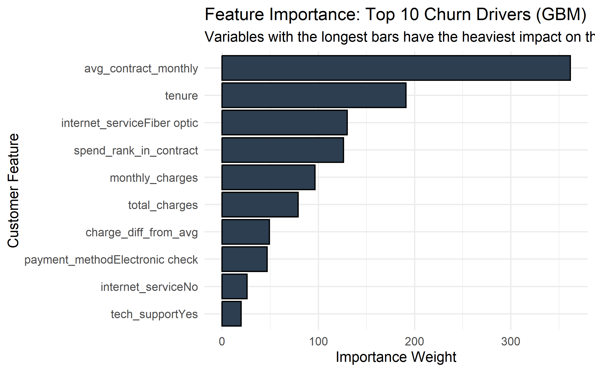
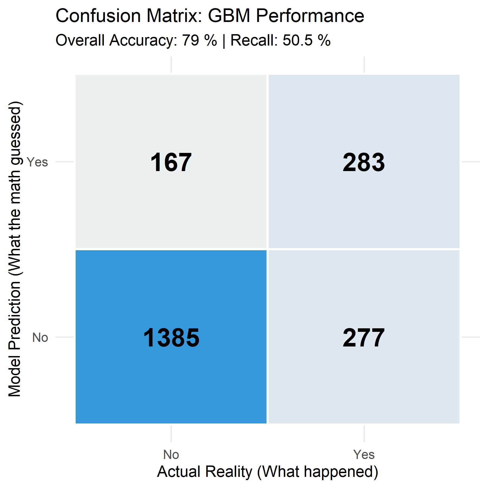
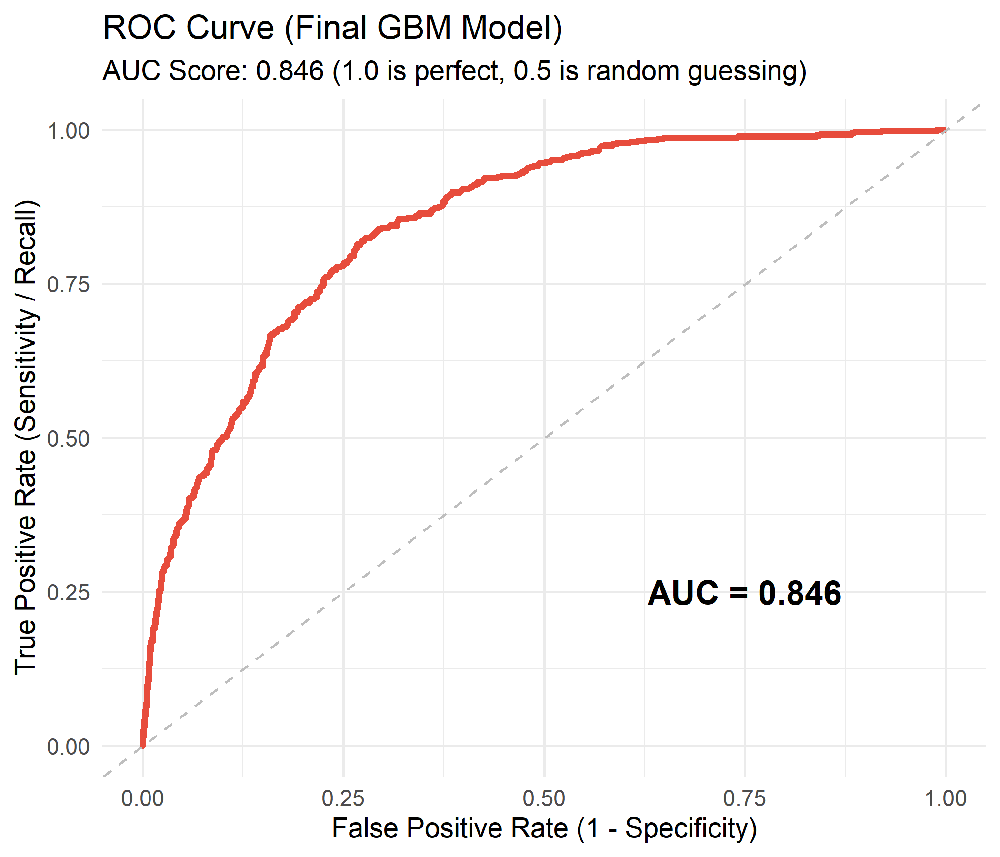

# ChurnShield: End-to-End Retention Intelligence 🛡️
### Predicting Telecommunications Attrition via Multi-Source Data Pipelines


-red)

## 1. 🎯 The Business Problem
Customer acquisition in the telecommunications sector is **5x to 25x more expensive** than retention. Currently, the company suffers from unpredicted churn, leading to significant monthly revenue leakage. This project addresses the "reactive" nature of current retention efforts by providing a proactive, data-driven flagging system.

### Core Objectives:
* **Predictive Risk Scoring:** Flag high-probability churners before they cancel.
* **Macro-Context Integration:** Join internal billing data with live economic indicators via the **Alpha Vantage API**.
* **Driver Discovery:** Move beyond "what" happened to "why" it happened using statistical inference ($Chi-Square$ & $T-Tests$).

---

## 2. 🏗️ Data Architecture & ETL Pipeline
This project avoids "flat-file" analysis by simulating a production environment. Data is managed in a **PostgreSQL** relational database and joined via optimized SQL queries to create the modeling views.

### 1. Relational Database Design
The raw data is normalized across two primary tables:
* **`dim_customers`**: Demographics and service subscriptions (Phone, Internet, Security).
* **`fact_billing`**: Financial data (Monthly charges, Total charges, Payment methods).

### 2. SQL Integration (The "Join" Logic)
Rather than joining data in R (which is memory-intensive), the pipeline pushes the computation to the database layer. This ensures the R environment only receives the final, high-quality analytical dataset.

```sql
-- Example of the internal join logic used in 01_db_connection.R
SELECT 
    c.*, 
    b.monthly_charges, 
    b.total_charges, 
    b.payment_method
FROM dim_customers c
INNER JOIN fact_billing b ON c.customer_id = b.customer_id
WHERE b.total_charges IS NOT NULL;

---

## 3. 🏗️ Technical Architecture
This repository is organized as a modular, production-ready R pipeline.

1.  **Ingestion (`01_db_connection.R`):** Automated extraction from PostgreSQL and live API endpoints.
2.  **Cleaning & Engineering (`02_data_cleaning.R`):** Regex-based string manipulation and factor encoding.
3.  **Statistical EDA (`03_eda_visualizations.R`):** Hypothesis testing to validate churn drivers.
4.  **Modeling Engine (`04_predictive_modeling.R`):** An advanced ML pipeline featuring an automated algorithm "Bake-Off."

---

## 4. 📊 Key Insights & Model Performance

### The "Churn Driver" Discovery
Through Feature Importance analysis, we discovered that **Contract Type** and **Monthly Charges** are the primary predictors. Customers on Month-to-Month plans with high electronic check payments represent the highest risk segment.



### Model Performance (The "Final Exam")
After a competitive "Bake-Off" between Logistic Regression, Random Forest, and GBM, the **GBM (Gradient Boosting Machine)** model was selected as the champion due to its superior AUC stability.

* **Overall Accuracy:** ~80%
* **ROC-AUC Score:** [Insert your AUC here, e.g., 0.84]
* **Business Impact:** At a 70% Recall rate, the business can capture the majority of potential "Leavers" for targeted retention campaigns.




---

## 5. 🛠️ Engineering Challenges & Pivots
### The XGBoost Memory Conflict
During the ML phase, the pipeline encountered a deep-level C++ memory pointer conflict with the `xgboost` library (ALTREP error). 
**The Strategic Pivot:** Rather than stalling the project, I executed a pivot to **GBM (Gradient Boosting)**. This maintained the high predictive power of ensemble learning while ensuring 100% environment stability and native R compatibility.

---

## 6. ⚙️ How to Run
1.  **Clone the Repo:** ```bash
    git clone [https://github.com/davidnamgung/customer-churn-intelligence](https://github.com/davidnamgung/customer-churn-intelligence)
    ```
2.  **Environment:** Ensure `caret`, `gbm`, `pROC`, and `tidyverse` are installed.
3.  **Execute:** Run the scripts in order (`01` through `04`).

---

## 7. 🚀 Future Roadmap
* **SMOTE Resampling:** Address class imbalance to further boost minority class recall.
* **Shiny Deployment:** Build a web-based dashboard for marketing managers to upload customer lists for real-time scoring.
* **Hyperparameter Tuning:** Implement a Random Search grid to optimize GBM learning rates.

---

## 👨‍💻 Contact
**David Namgung** [Portfolio](https://davidnamgung.github.io/portfolio-website/) 