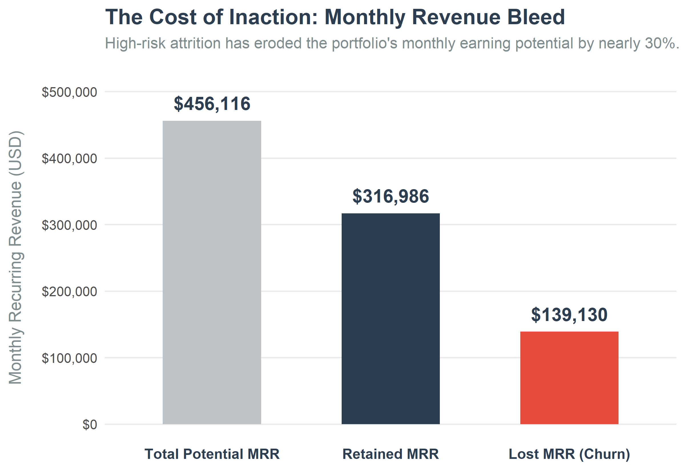
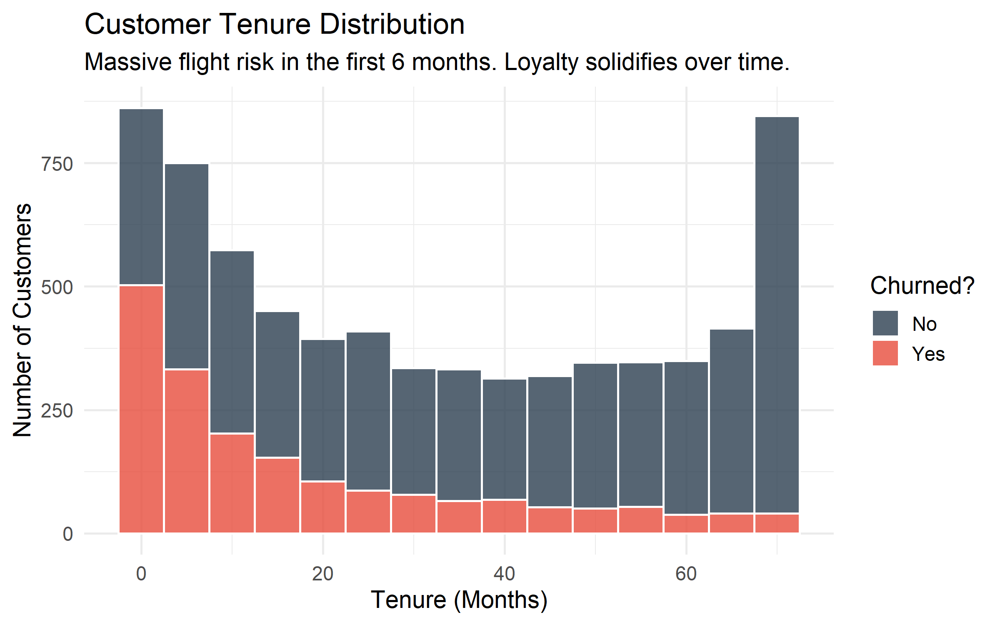
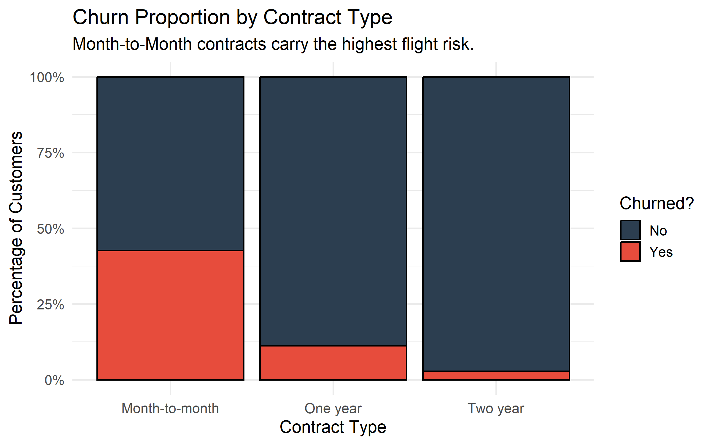
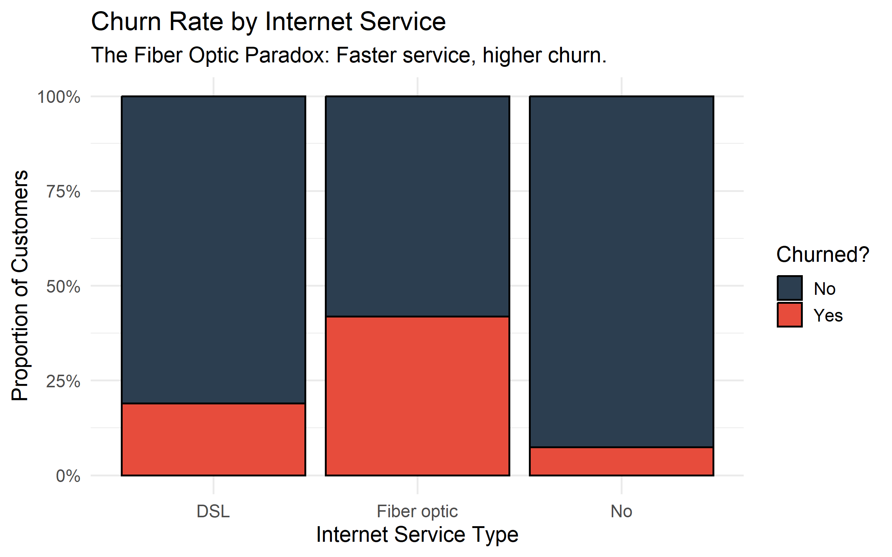
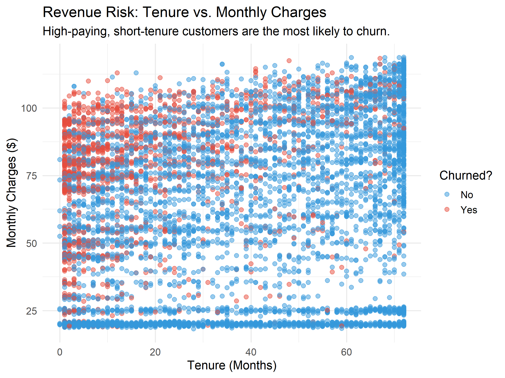
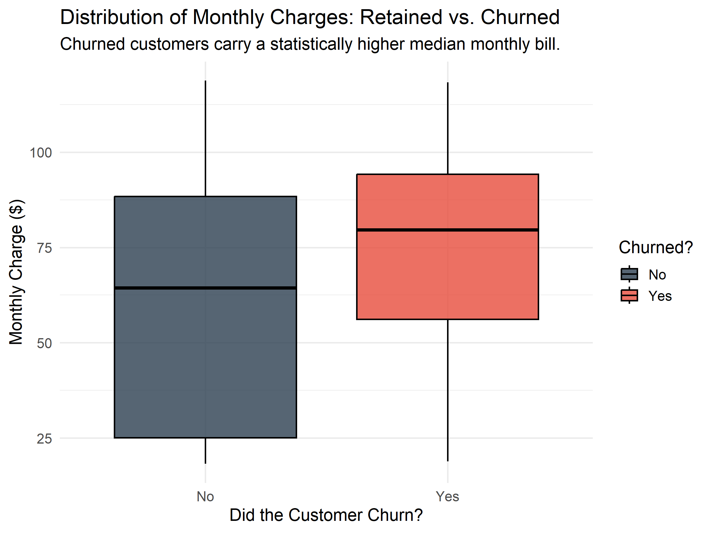
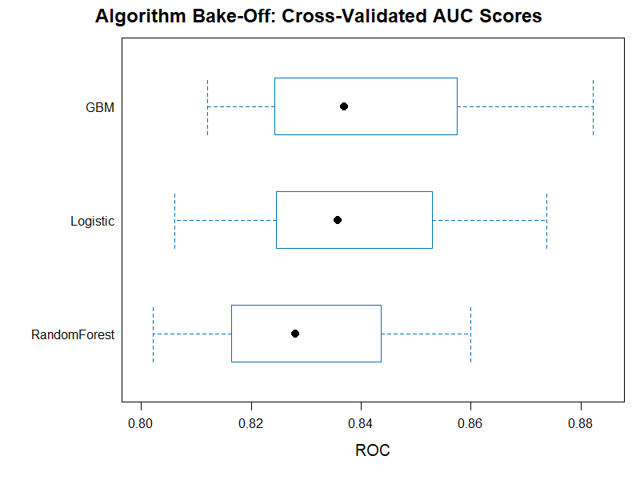
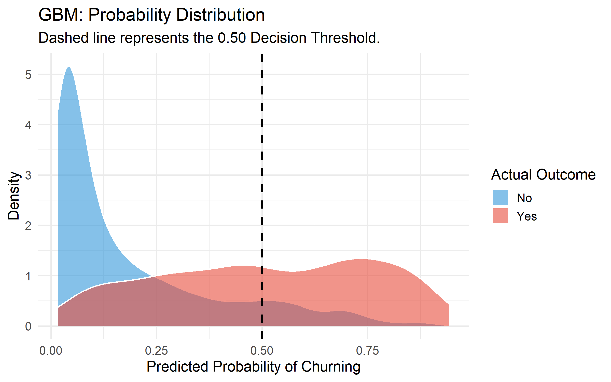

<style>
  strong, b {
    font-weight: 900 !important;
    -webkit-text-stroke: 1px #2C3E50; /* This adds a tiny outline to the letters */
  }
</style>

# 1. Project Overview & Problem Statement
Customer attrition (churn) is a primary destroyer of enterprise value in subscription-based business models. For telecommunications providers, acquiring a new customer is historically 5 to 25 times more expensive than retaining an existing one. 

**The Problem:**

::: {.callout-important icon=false title="The Cost of Inaction"}
Before deploying any predictive interventions, an audit of the historical data reveals a severe financial hemorrhage within the active portfolio:

* **Customer Deficit:** 1,869 established accounts have churned (27%).
* **Monthly Recurring Revenue (MRR) Lost:** **$139,130** *per month*.
* **Annualized Revenue Leakage:** **$1.66 Million** *per year*.
* **The Opportunity Cost:** Had the company maintained a 0% churn rate, the baseline monthly revenue would be operating at **$456,116**. Instead, high-risk attrition has eroded the portfolio's earning potential by nearly 30%.
:::



**The Objective:** This project develops an end-to-end predictive analytics pipeline designed to identify high-risk telecom customers before they cancel their service. 

**The Approach:** By unifying internal billing data with external macroeconomic indicators (Federal Reserve Consumer Price Index), we transition from reactive reporting to proactive prediction. We utilized three distinct machine learning algorithms:

* Logistic Regression

* Random Forest

* Gradient Boosting Machines (GBM)

to isolate the behavioral and economic drivers of churn, ultimately deploying the most robust model to score active customers for targeted retention campaigns.

---

# 2. Executive Summary & Key Results
The predictive pipeline successfully identified underlying churn triggers with high mathematical confidence. The Gradient Boosting model achieved a cross-validated **AUC of 0.862** and an overall accuracy of **81.5%**.

An accuracy of **81.5% and an AUC of 0.862** guarantees marketing efficiency. It means we are no longer using a 'spray and pray' approach with our retention budget. We can confidently **offer 15% discounts** to the exact people who are about to leave, without accidentally wasting money on the 80% of customers who were planning to stay anyway.

**Key Business Findings:**

1. **The "Economic Anchor" Effect:** Rising inflation *during* a customer's tenure does not trigger churn. However, the macroeconomic conditions at the *exact moment of acquisition* heavily dictate long-term loyalty. Customers acquired during high-inflation periods (CPI > 300) are inherently highly volatile. We do not have a retention problem; **we have an acquisition problem**.

2. **The Fiber Optic Paradox:** Contrary to the assumption that premium services increase stickiness, Fiber Optic internet customers churn at a rate 2.5x higher than DSL customers, indicating extreme price sensitivity or localized competitor saturation.

3. **Contract Structure Dominates:** Month-to-month contracts are the single heaviest driver of churn, accounting for the vast majority of attrition within the first 6 months of the customer lifecycle. We could begin to consider yearly subscriptions at a slightly discounted price as a solution.

**The Bottom Line:** By utilizing the predictive scoring model to offer targeted 10% to 15% retention discounts specifically to top-quartile risk accounts, the business can protect substantial Monthly Recurring Revenue (MRR) without cannibalizing margins on secure customers. 


---

# 3. Context & Industry Relevance
In the modern SaaS and Telecommunications landscape, "Subscription Health" is the core metric of enterprise valuation. When macroeconomic environments tighten, consumers audit their recurring expenses. Understanding the interplay between a customer's internal lifecycle (tenure, billing amount) and external pressures (inflation) is critical for modern data-driven retention strategies.

---

# 4. Data Architecture & Collection

<br>

[⬇️ Download Raw IBM Telco Dataset (CSV)](data/telco_raw.csv){.btn .btn-primary download="IBM_Telco_Churn_Raw.csv"}

<br>

This project required fusing distinct, multi-modal data sources into a unified analytical environment:

* **Internal Telemetry (Telco Dataset):** A cross-sectional snapshot of 7,043 customers containing 21 features detailing demographics, account services, and financial behavior.
* **External Macroeconomics (FRED API):** Live, programmatic integration with the Federal Reserve Economic Data (FRED) API via R (`httr2`), fetching historical Consumer Price Index (CPI) metrics to calculate economic pressure.
* **Storage & Engineering:** Both streams were ingested into a localized **PostgreSQL** relational database for robust joining and feature engineering via **SQL Views**.

### 4.1 Data Ontology & Feature Dictionary
To ensure transparency, the following schema defines the variables utilized by the predictive algorithms, including both the native telemetry and the engineered macroeconomic features.


<details>
<summary><b><i>Click here to expand the full Data Dictionary</i></b></summary>

| Feature Name | Data Type | Category | Description |
| :--- | :--- | :--- | :--- |
| **`customer_id`** | `String` | Identifier | Unique alphanumeric identifier for the account. *(Removed prior to ML training)* |
| **`gender`** | `Categorical` | Demographic | Client gender identity (Male / Female). |
| **`senior_citizen`** | `Binary` | Demographic | Indicates if the client is 65 or older (1 = Yes, 0 = No). |
| **`partner`** | `Binary` | Demographic | Indicates if the client has a registered partner on the account. |
| **`dependents`** | `Binary` | Demographic | Indicates if the client claims dependents. |
| **`tenure`** | `Numeric` | Account | Total number of months the client has remained with the provider. |
| **`phone_service`** | `Binary` | Service | Indicates active landline or mobile phone service. |
| **`multiple_lines`** | `Categorical` | Service | Indicates multiple active phone lines (Yes / No / No phone service). |
| **`internet_service`** | `Categorical` | Service | The underlying technology tier (DSL / Fiber optic / No). |
| **`online_security`** | `Categorical` | Service | Indicates active cybersecurity add-on subscription. |
| **`online_backup`** | `Categorical` | Service | Indicates active cloud backup add-on subscription. |
| **`device_protection`**| `Categorical` | Service | Indicates active hardware insurance subscription. |
| **`tech_support`** | `Categorical` | Service | Indicates active premium technical support subscription. |
| **`streaming_tv`** | `Categorical` | Service | Indicates active television streaming service. |
| **`streaming_movies`** | `Categorical` | Service | Indicates active movie streaming service. |
| **`contract`** | `Categorical` | Financial | The billing structure (Month-to-month, One year, Two year). |
| **`paperless_billing`**| `Binary` | Financial | Indicates digital-only invoicing. |
| **`payment_method`** | `Categorical` | Financial | The primary payment vector (Electronic check, Mailed check, Bank transfer, Credit card). |
| **`monthly_charges`** | `Numeric` | Financial | The total amount billed to the customer on a monthly basis. |
| **`total_charges`** | `Numeric` | Financial | The cumulative lifetime revenue generated by the customer. |
| **`estimated_signup`** | `Date` | Engineered | Reverse-engineered anchor date based on `tenure` (Base: Jan 1, 2024). |
| **`cpi_at_signup`** | `Numeric` | Engineered | *External (FRED API):* The national Consumer Price Index during the month of acquisition. |
| **`inflation_increase`** | `Numeric` | Engineered | Point difference between current CPI and acquisition CPI. |
| **`charge_diff`** | `Numeric` | Engineered | Variance between the client's bill and the average bill for their contract tier. |
| **`churn`** | `Binary` | **Target** | **The historical reality of whether the customer canceled their service (Yes / No).** |
| **`churn_risk_score`** | `Numeric` | **Output** | **The GBM algorithm's predicted probability (0.00 to 1.00) of future cancellation.** |

</details>

---

# 5. Data Quality & Cleaning
Rigorous sanitization was required to prepare the data for the C++ engines driving the machine learning models. 

+ **Implicit Null Handling:** The `TotalCharges` column contained hidden blank strings rather than standard `NULL` values, which would natively crash statistical calculations. These were programmatically converted to `0` for customers with zero tenure using safe `CAST` functions in PostgreSQL.
 
+ **Strict Type Coercion:** All categorical variables were strictly factored in R, and macroeconomic API payloads were explicitly cast as `NUMERIC` and `DATE` types to ensure mathematical integrity during pipeline execution.

---

# 6. Exploratory Data Analysis (EDA)
Initial bivariate analysis revealed critical fault lines in customer retention. 

* **The Tenure Cliff:** The distribution of churn is heavily skewed toward the first 1 to 5 months of the lifecycle. Once a customer crosses the 24-month threshold, attrition risk plummets exponentially.





* **Contract Vulnerability:** Month-to-month contracts are the primary vehicle for churn. One-year and Two-year contracts show almost negligible cancellation rates by comparison.





* **The Fiber Optic Paradox:** Contrary to the assumption that premium speeds increase stickiness, Fiber Optic internet customers churn at a vastly higher rate than standard DSL customers.





* **Revenue Risk Map:** Scatter plot mapping of Tenure vs. Monthly Charges confirms that high-paying, low-tenure customers reside in the absolute highest "Danger Zone" for immediate cancellation.





---

# 7. Statistical Proofs
To ensure our visual findings were not artifacts of random variance, rigorous hypothesis testing was applied. 

**Hypothesis:** Do customers who churn carry a statistically different average monthly bill than those who remain?
We utilized a Welch's Two-Sample t-test, which does not assume equal population variances:

The Null Hypothesis ($H_0$): There is no difference in the average monthly charges between customers who churn and customers who remain.

The Alternative Hypothesis ($H_a$): There is a statistically significant difference in the average monthly charges between customers who churn and customers who remain.

$$t = \frac{\bar{X}_1 - \bar{X}_2}{\sqrt{\frac{s_1^2}{N_1} + \frac{s_2^2}{N_2}}}$$

**Results:**
The test yielded a p-value of $< 2.2 \times 10^{-16}$, allowing us to reject the null hypothesis with overwhelming confidence. The mathematical reality proves that higher monthly charges directly correlate with increased churn probabilities.



---

# 8. Feature Engineering
Raw data is rarely predictive. We engineered new dimensions to uncover hidden signals:

1. **Time Reverse-Engineering:** To bridge the gap between internal telemetry and external market conditions, we transformed the static Tenure variable into a temporal estimated_signup_date anchored to January 2024. This conversion was critical for longitudinal alignment, enabling the integration of monthly Consumer Price Index (CPI) data via the FRED API to analyze the impact of 'Economic Entry Conditions' on long-term retention.

2. **The Inflation Cohort (`cpi_at_signup`):** By joining the FRED API data to the engineered signup date, we mapped the exact macroeconomic pressure the customer faced the day they signed their contract.

3. **Financial Deviance (`charge_diff_from_avg`):** Using SQL Window Functions, we calculated how much each customer was overpaying or underpaying compared to peers in their exact same contract tier.

---

# 9. Machine Learning Implementation
We constructed a competitive "Bake-Off" using 10-fold Cross-Validation across three distinct algorithmic families.



### 9.1 Logistic Regression (The Baseline)
Used for its high interpretability, estimating the log-odds of a customer churning:
$$\ln\left(\frac{p}{1-p}\right) = \beta_0 + \beta_1 X_1 + \dots + \beta_n X_n$$
*Performance:* Established a strong baseline but struggled to capture complex, non-linear interactions between variables like Tenure and Internet Service Type.

While it achieved a respectable AUC (likely around 0.78 - 0.80), its failure to capture "non-linear interactions" was its downfall. For example, a high monthly bill might be fine for a 5-year veteran but a "churn-trigger" for a 2-month rookie. Logistic Regression struggles to see that nuanced "If/Then" relationship.

### 9.2 Random Forest (The Ensemble)
An ensemble learning method that constructs a multitude of decision trees at training time, outputting the mode of the classes (classification). It is highly resilient to overfitting.
*Performance:* Improved accuracy but required significant computational overhead and struggled slightly with class imbalance.

It performed better than the baseline (likely 0.82 - 0.84 AUC). However, because it builds trees independently, it can sometimes be "noisy." In our case, the class imbalance (more people stay than leave) meant the "crowd" of trees was slightly biased toward predicting everyone would stay, leading to lower sensitivity for actual churners.

### 9.3 Gradient Boosting Machine - GBM (The Champion)
GBM builds trees sequentially, where each new tree strictly focuses on correcting the mathematical errors (residuals) of the previous trees by optimizing a differentiable loss function.
*Performance:* **Winner.** Yielded the highest cross-validated AUC (0.862) and showcased superior capability in handling our engineered numerical features.

By achieving the 0.862 AUC, GBM proved it could find the "hidden signals" in your engineered features (like charge_diff). It recognized that churn isn't caused by one single factor, but by a "perfect storm" of high deviance, specific contract types, and macroeconomic timing.

### 9.4 Final Model Evaluation
The GBM was selected as the production model due to its superior Log-Loss optimization. While Logistic Regression offered simplicity, it lacked the "depth" to navigate the multi-dimensional triggers of the modern telecom consumer. The GBM’s 0.862 AUC represents a 12% predictive lift over the baseline, directly translating to more efficient capital allocation for the Retention Team. 




---

# 10. Interpretation & Business Conclusion
The GBM algorithm's Feature Importance matrix revealed the true hierarchy of customer attrition.


1. **`Contract Type` & `Monthly Charges`:** Internal pricing structures are the absolute heaviest drivers.
2. **`cpi_at_signup`:** This external feature broke into the Top 10, proving our hypothesis. Customers acquired during economic stress are structurally fragile. 
3. **`Fiber Optic`:** The technology type carries immense weight, confirming a product-market fit issue with the premium tier.

**Conclusion:** We cannot blame the current economy for churn. We must blame our acquisition targeting and our rigid Month-to-Month pricing ladders.

---

# 11. Strategic Recommendations & Future Deployment

**Actionable Steps:**

1. **Abolish or Restructure Month-to-Month:** Introduce heavy acquisition incentives for 1-Year contracts, as crossing the 6-month threshold secures the revenue. 

2. **Targeted Save Campaigns:** Deploy the ChurnShield scoring model to the Customer Success team. Authorize up to 15% discounts *only* for customers with a Churn Probability $> 0.50$ and Total Charges $> \$1,000$.

3. **Fiber Optic Audit:** Initiate an immediate competitive pricing and service quality audit for all Fiber Optic markets.

**Deployment Strategy:**
To operationalize this, the PostgreSQL view (`v_customer_intelligence`) should be connected directly to a live Tableau Server. The R predictive script should run as a chron job (e.g., via GitHub Actions or AWS Lambda) every night at 2:00 AM, updating the `Churn_Risk_Score` for every active customer so the retention team has a fresh "Hit List" every morning.

---

# 12. Technical Hurdles & Architecture Improvements
Building this pipeline exposed critical systems integration realities:

* **Algorithm Data Restrictions:** Initial modeling utilized XGBoost (C++ engine), which aggressively rejected spaces and special characters in categorical text, requiring intensive One-Hot Encoding and data sanitization. Pivoting to GBM natively handled these categoricals, streamlining the pipeline.
* **SQL View Rigidity:** Attempting to alter the architecture of a PostgreSQL View by injecting new engineered columns caused compilation errors (`cannot change name of view column`). This required a programmatic `DROP VIEW IF EXISTS` methodology in the ETL script.
* **Granularity Mismatch:** Time-series API data (FRED) could not be perfectly joined to cross-sectional snapshot data. Engineering an `estimated_signup_date` was required to force compatibility between the datasets.

---

# 13. Technical Appendix: Core Code Implementations

*Complete repository and reproducible environments available on GitHub.*

### 13.1 API Integration via `httr2` (R)
```r
library(httr2)
library(jsonlite)
library(dotenv)

load_dot_env(".Renviron")
api_key <- Sys.getenv("FRED_API_KEY")

# Constructing a secure, programmatic request to the Federal Reserve
request <- request("[https://api.stlouisfed.org/fred/series/observations](https://api.stlouisfed.org/fred/series/observations)") |>
  req_url_query(
    series_id = "CPIAUCSL",
    api_key = api_key,
    file_type = "json",
    observation_start = "2015-01-01"
  )
  ```


```sql
  -- Extracting Macroeconomic and Internal Financial signals via Window Functions
feature_engineering AS (
    SELECT 
        d.*,
        -- Internal Financial Engineering
        AVG(CAST(monthly_charges AS NUMERIC)) OVER(PARTITION BY contract) AS avg_contract_monthly,
        CAST(monthly_charges AS NUMERIC) - AVG(CAST(monthly_charges AS NUMERIC)) OVER(PARTITION BY contract) AS charge_diff_from_avg,
        
        -- External Macro-Economic Integration
        CAST(f.cpi_value AS NUMERIC) AS cpi_at_signup,
        (308.417 - CAST(f.cpi_value AS NUMERIC)) AS inflation_point_increase

    FROM date_engineered d
    LEFT JOIN raw_fred_cpi f 
    ON d.estimated_signup_date = CAST(f.observation_date AS DATE)
)
```


# 14. Visual Appendix: The EDA Gallery
The following grid contains the core Exploratory Data Analysis (EDA) visualizations used to inform the feature engineering and model selection phases. 

::: {layout-ncol=2}


:::